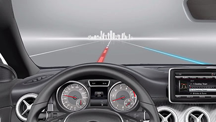
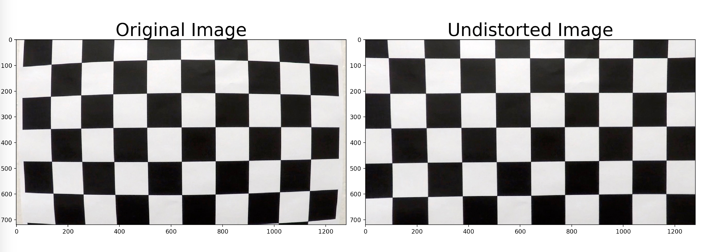
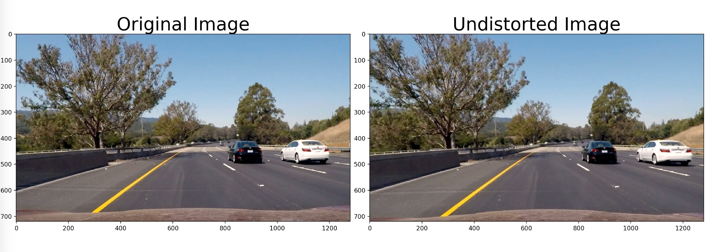
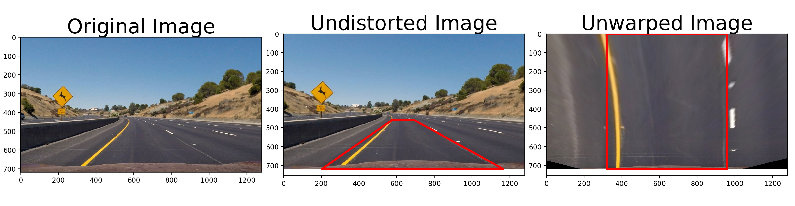
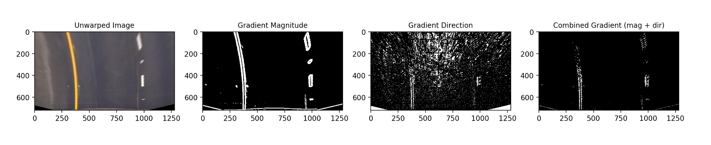
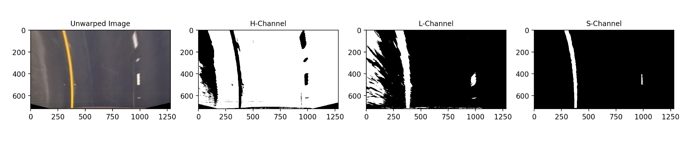
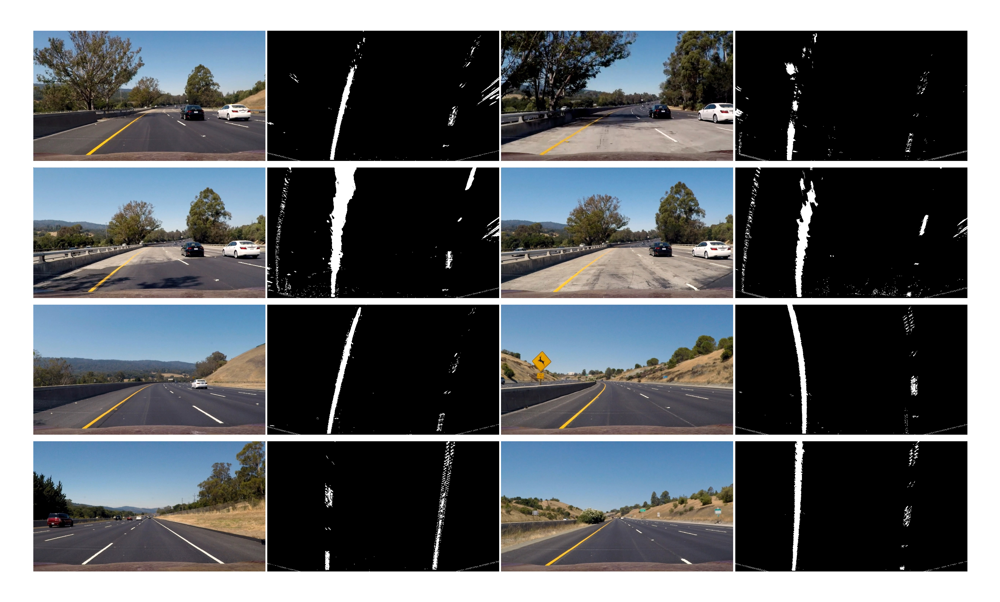
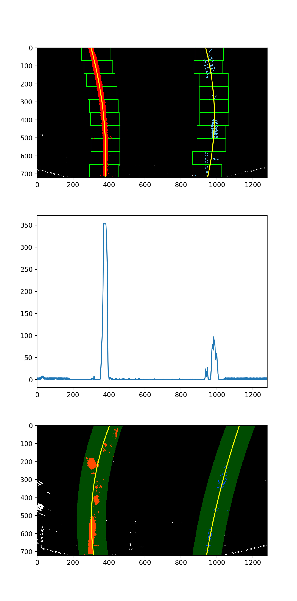
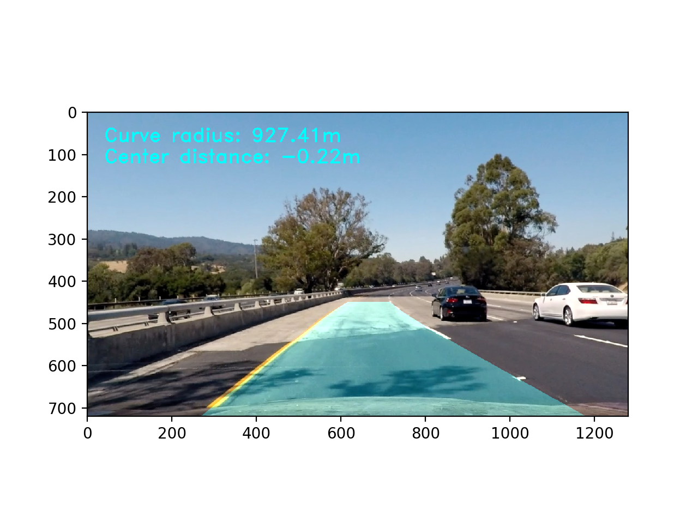

# Self-driving Car Project: Advanced Lane Lines Detection and Tracking

<center>

</center>

Hello there! I'm Babak. Let me introduce you to my project. In this project, I used computer vision techniques to detect and track lane lines from a front-facing stereo camera. This algorithm can be used in conjunction with steering control for ADAS functions such as lane keep assist, and lane departure warning. This project was written using Python object oriented programming.

### Pipeline:

The steps of this project are the following:

* Compute the camera calibration matrix and distortion coefficients given a set of chessboard images.
* Apply a distortion correction to raw images.
* Apply a perspective transform to rectify image ("birds-eye view").
* Use color transforms, gradients, etc. to create a thresholded binary image.
* Detect lane pixels and fit to find the lane boundary.
* Determine the curvature of the lane.
* Warp the detected lane boundaries back onto the original image.
* Output visual display of the lane boundaries and numerical estimation of lane curvature.

---

### Detailed Pipeline (single images)

#### 1. Camera calibration 

I start camera calibration by using chessboard images. Using the function `cv2.findChessboardCorners()` I get the corners of the chessboard. I drew the corners on the chessboard images as shown below using the function `cv2.drawChessboardCorners`. 

<center>

</center>

I then prepared "object points", which will be the (x, y, z) coordinates of the chessboard corners in the world. Here I am assuming the chessboard is fixed on the (x, y) plane at z=0, such that the object points are the same for each calibration image.  Thus, `objp` is just a replicated array of coordinates, and `objpoints` will be appended with a copy of it every time I successfully detect all chessboard corners in a test image.  `imgpoints` will be appended with the (x, y) pixel position of each of the corners in the image plane with each successful chessboard detection. Finally, used the output `objpoints` and `imgpoints` to compute the camera calibration  matrix and distortion coefficients using the `cv2.calibrateCamera()` function.  

#### 2. Distortion correction

Using the camera matrix and distortion coefficients from the previous step, I applied this distortion correction to the test image using the `cv2.undistort()` function and obtained this result: 

For the chessboard image:

<center>

</center>

And for the road image:

<center>

</center>

#### 3. Perspective transform

The code for my perspective transform includes two functions. First, calculated the perspective transform matrix using `cv2.getPerspectiveTrandform` function from four points on the original image (source points) to four desired image points (destination points). Then used `cv2.warpPerspective()` function, it takes the undistorted image and perspective transform to apply the perspective transform. I chose the source and destination points as follows by measuring the input images:

| Source        | Destination   | 
|:-------------:|:-------------:| 
| 575, 460      | 450, 0        | 
| 707, 460      | 850, 0     	  |
| 260, 680      | 450, 700  	  |
| 1050, 680     | 850, 700      |

I verified that my perspective transform was working as expected by drawing the `src` and `dst` points onto the original image and its transformed counterpart..

<center>

</center>

#### 3. Combining color and gradient thresholds

I used a combination of color and gradient thresholds to generate a binary image.  Here's my output for this step. 

The Sobel gradient thresholds:

<center>

</center>

The HLS color thresholds:

<center>

</center>

And the combined gradient and HLS color thresholds:

<center>

</center>

#### 4. Identify lane-line pixels and fit their positions with a polynomial

Then I did fit my lane lines with a 2nd order polynomial like this:

<center>

</center>

#### 5. Calculating the radius of curvature of the lane

The function to calculate the radius of curvature of the lane is as follows:

```python
# Calculates radius of curvature and distance from lane center 
def measure_curvature(bin_img, l_fit, r_fit, l_lane_inds, r_lane_inds, ploty):
  
  # Define conversions in x and y from pixels space to meters
  ym_per_pix = 30./720 # meters per pixel in y dimension
  xm_per_pix = 3.7/700 # meters per pixel in x dimension
  carm_pos = (1280 / 2) * xm_per_pix # lane center pos in meters

  left_curverad, right_curverad, center_dist = (0, 0, 0)

  # Define maximum y-value corresponding to the bottom of the image
  y_eval = np.max(ploty)

  # Identify the x and y positions of all nonzero pixels in the image
  nonzero = bin_img.nonzero()
  nonzeroy = np.array(nonzero[0])
  nonzerox = np.array(nonzero[1])

  leftx = nonzerox[l_lane_inds]
  lefty = nonzeroy[l_lane_inds] 
  rightx = nonzerox[r_lane_inds]
  righty = nonzeroy[r_lane_inds]
  
  # Fit new polynomials to x,y in world space
  left_fit_cr = np.polyfit(lefty*ym_per_pix, leftx*xm_per_pix, 2)
  right_fit_cr = np.polyfit(righty*ym_per_pix, rightx*xm_per_pix, 2)
  
  # Calculate the new radii of curvature
  left_curverad = ((1 + (2*left_fit_cr[0]*y_eval*ym_per_pix + left_fit_cr[1])**2)**1.5) / np.absolute(2*left_fit_cr[0])
  right_curverad = ((1 + (2*right_fit_cr[0]*y_eval*ym_per_pix + right_fit_cr[1])**2)**1.5) / np.absolute(2*right_fit_cr[0])

  left_line = polynomial(left_fit_cr, bin_img.shape[0] * ym_per_pix)
  right_line = polynomial(right_fit_cr, bin_img.shape[0] * ym_per_pix)
  center_dist = carm_pos - ((left_line + right_line) / 2)

  # Now our radius of curvature is in meters
  print('Left lane radius: ',left_curverad,'m ','Right lane radius: ',right_curverad,'m' , 'Center lane radius: ',center_dist)
  return left_curverad, right_curverad, center_dist
```
#### 6. Image of result plotted back down onto the road such that the lane area is identified clearly

With lane radius calculations:

<center>

</center>
---

### Pipeline (video)

#### 1. Final video output 

Here's a [link to my video result](./Final_project_video_test_output.mp4) 

---

### Discussion on making the pipeline more robust?

This was a very challenging project, meaning that coming up with lane line detection and tracking pipeline is feasible using computer vision techniques but testing the pipeline under various scenarios and conditions such as faded lane lines or shadows on the lane lines, etc. is what makes this project more challenging. Testing the pipeline is very important to make sure the algorithm can be generalized to different roads and conditions. Some conditions such as faded lane lines or shadows was addressed using different gradient or color space thresholds, also the region of interest definition for perspective transform is very important in accurate detection and tracking. I will further improve my algorithm to be more robust. These include testing more color space thresholding (or different combinations), removing new fits that deviate more than a certain amount or if fits are not parallel force parallel fits, smoothing out the detection and optimizing the python script so that the code execution and lane line detction and tracking can be done in real-time. Also, would like to try deep learning techniques for the same problem. 

