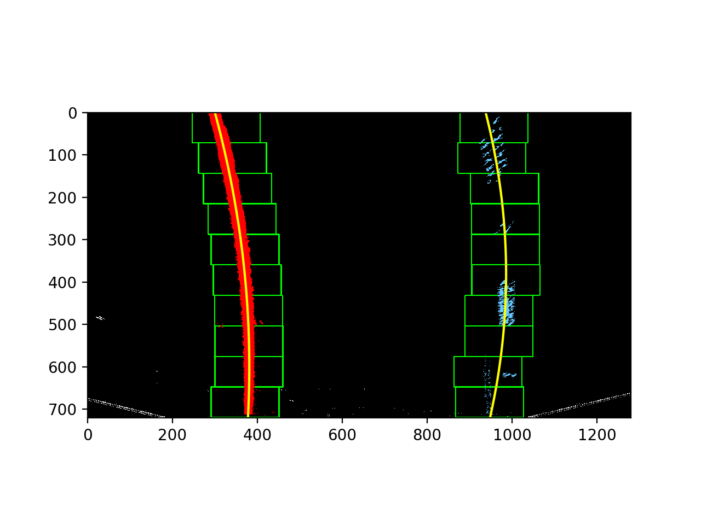
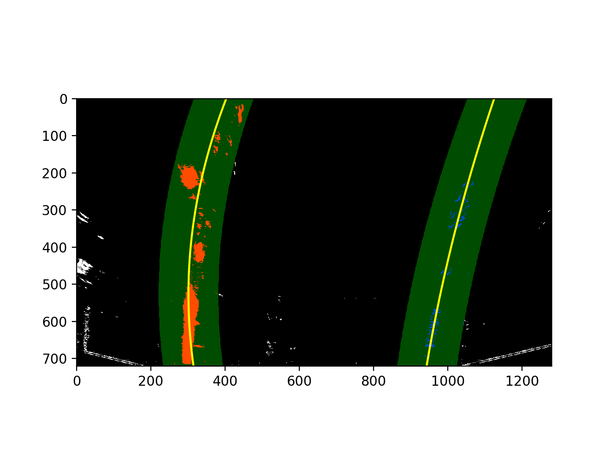
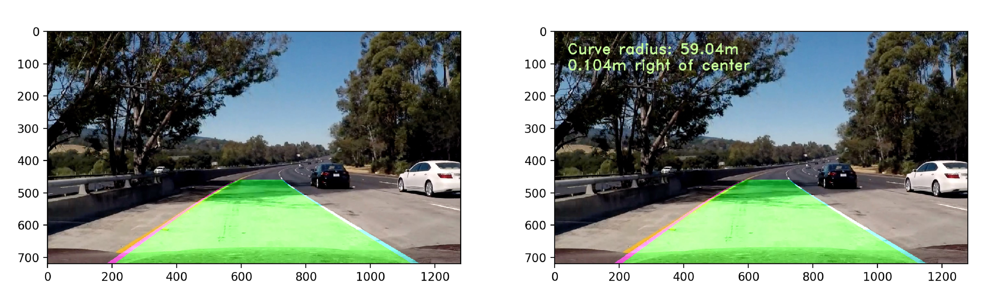

# Self-driving Car Project: Advanced Lane Lines Detection and Tracking

<center>

</center>

Hello there! I'm Babak. Let me introduce you to my project. In this project, I used computer vision techniques to detect and track lane lines from a front-facing stereo camera. This algorithm can be used in conjunction with steering control for ADAS functions such as lane keep assist, and lane departure warning. This project was written using Python object oriented programming.

### Pipeline:

The steps of this project are the following:

* Compute the camera calibration matrix and distortion coefficients given a set of chessboard images.
* Apply a distortion correction to raw images.
* Apply a perspective transform to rectify image ("birds-eye view").
* Use color transforms, gradients, etc. to create a thresholded binary image.
* Detect lane pixels and fit to find the lane boundary.
* Determine the curvature of the lane and vehicle position with respect to center.
* Warp the detected lane boundaries back onto the original image.
* Output visual display of the lane boundaries and numerical estimation of lane curvature and vehicle position.

---

### Detailed Pipeline (single images)

#### 1. Camera calibration 

I start camera calibration by using chessboard images. Using the function `cv2.findChessboardCorners()` I get the corners of the chessboard. I drew the corners on the chessboard images as shown below using the function `cv2.drawChessboardCorners`. 

<center>

</center>

I then prepared "object points", which will be the (x, y, z) coordinates of the chessboard corners in the world. Here I am assuming the chessboard is fixed on the (x, y) plane at z=0, such that the object points are the same for each calibration image.  Thus, `objp` is just a replicated array of coordinates, and `objpoints` will be appended with a copy of it every time I successfully detect all chessboard corners in a test image.  `imgpoints` will be appended with the (x, y) pixel position of each of the corners in the image plane with each successful chessboard detection. Finally, used the output `objpoints` and `imgpoints` to compute the camera calibration  matrix and distortion coefficients using the `cv2.calibrateCamera()` function.  

#### 2. Distortion correction

Using the camera matrix and distortion coefficients from the previous step, I applied this distortion correction to the test image using the `cv2.undistort()` function and obtained this result: 

For the chessboard image:

<center>

</center>

And for the road image:

<center>

</center>

#### 3. Perspective transform

The code for my perspective transform includes two functions. First, calculated the perspective transform matrix using `cv2.getPerspectiveTrandform` function from four points on the original image (source points) to four desired image points (destination points). Then used `cv2.warpPerspective()` function, it takes the undistorted image and perspective transform to apply the perspective transform. I chose the source and destination points as follows by measuring the input images:

| Source        | Destination   | 
|:-------------:|:-------------:| 
| 575, 460      | 450, 0        | 
| 707, 460      | 850, 0     	  |
| 260, 680      | 450, 700  	  |
| 1050, 680     | 850, 700      |

I verified that my perspective transform was working as expected by drawing the `src` and `dst` points onto the original image and its transformed counterpart..

<center>

</center>

#### 3. Combining color and gradient thresholds

I used a combination of color and gradient thresholds to generate a binary image (thresholding steps at lines 227 through 241 in `Clean_AdvancedLaneLine.py`).  Here's my output for this step. 

The Sobel gradient thresholds:

<center>

</center>

The HLS color thresholds:

<center>

</center>

And the combined gradient and HLS color thresholds:

<center>

</center>

#### 4. Identify lane-line pixels and fit their positions with a polynomial.

Then I did fit my lane lines with a 2nd order polynomial like this (lines 245 through 361 in `Clean_AdvancedLaneLine.py`):

<!--<center>

</center>-->

<center>

</center>

<!--<center>

</center>-->

#### 5. Calculating the radius of curvature of the lane and the position of the vehicle with respect to center.

The code to calculate the radius of curvature of the lane and the position of the vehicle with respect to center is as follows (lines 363 through 406 in `Clean_AdvancedLaneLine.py`):

```python
# Method to determine radius of curvature and distance from lane center 
# based on binary image, polynomial fit, and L and R lane pixel indices
def calc_curv_rad_and_center_dist(bin_img, l_fit, r_fit, l_lane_inds, r_lane_inds):
    # Define conversions in x and y from pixels space to meters
    ym_per_pix = 3.048/100 # meters per pixel in y dimension, lane line is 10 ft = 3.048 meters
    xm_per_pix = 3.7/378 # meters per pixel in x dimension, lane width is 12 ft = 3.7 meters
    left_curverad, right_curverad, center_dist = (0, 0, 0)
    # Define y-value where we want radius of curvature
    # I'll choose the maximum y-value, corresponding to the bottom of the image
    h = bin_img.shape[0]
    ploty = np.linspace(0, h-1, h)
    y_eval = np.max(ploty)
  
    # Identify the x and y positions of all nonzero pixels in the image
    nonzero = bin_img.nonzero()
    nonzeroy = np.array(nonzero[0])
    nonzerox = np.array(nonzero[1])
    # Again, extract left and right line pixel positions
    leftx = nonzerox[l_lane_inds]
    lefty = nonzeroy[l_lane_inds] 
    rightx = nonzerox[r_lane_inds]
    righty = nonzeroy[r_lane_inds]
    
    if len(leftx) != 0 and len(rightx) != 0:
        # Fit new polynomials to x,y in world space
        left_fit_cr = np.polyfit(lefty*ym_per_pix, leftx*xm_per_pix, 2)
        right_fit_cr = np.polyfit(righty*ym_per_pix, rightx*xm_per_pix, 2)
        # Calculate the new radii of curvature
        left_curverad = ((1 + (2*left_fit_cr[0]*y_eval*ym_per_pix + left_fit_cr[1])**2)**1.5) / np.absolute(2*left_fit_cr[0])
        right_curverad = ((1 + (2*right_fit_cr[0]*y_eval*ym_per_pix + right_fit_cr[1])**2)**1.5) / np.absolute(2*right_fit_cr[0])
        # Now our radius of curvature is in meters
    
    # Distance from center is image x midpoint - mean of l_fit and r_fit intercepts 
    if r_fit is not None and l_fit is not None:
        car_position = bin_img.shape[1]/2
        l_fit_x_int = l_fit[0]*h**2 + l_fit[1]*h + l_fit[2]
        r_fit_x_int = r_fit[0]*h**2 + r_fit[1]*h + r_fit[2]
        lane_center_position = (r_fit_x_int + l_fit_x_int) /2
        center_dist = (car_position - lane_center_position) * xm_per_pix
    return left_curverad, right_curverad, center_dist
print('...')

rad_l, rad_r, d_center = calc_curv_rad_and_center_dist(exampleImg_bin, left_fit, right_fit, left_lane_inds, right_lane_inds)

print('Radius of curvature for example:', rad_l, 'm,', rad_r, 'm')
print('Distance from lane center for example:', d_center, 'm')
```
#### 6. Image of result plotted back down onto the road such that the lane area is identified clearly.

With and without radius and lane calculations (lines 410 through 458 in `Clean_AdvancedLaneLine.py`):

<center>

</center>
---

### Pipeline (video)

#### 1. Final video output 

(lines 460 through 647 in `Clean_AdvancedLaneLine.py`)
Here's a [link to my video result](./project_video_output.mp4) 

---

### Discussion on making the pipeline more robust?

I will improve my algorithm to be more robust. These include different color space thresholding, removing new fits that deviate more than a certain amount or if fits are not parallel force parallel fits. 

